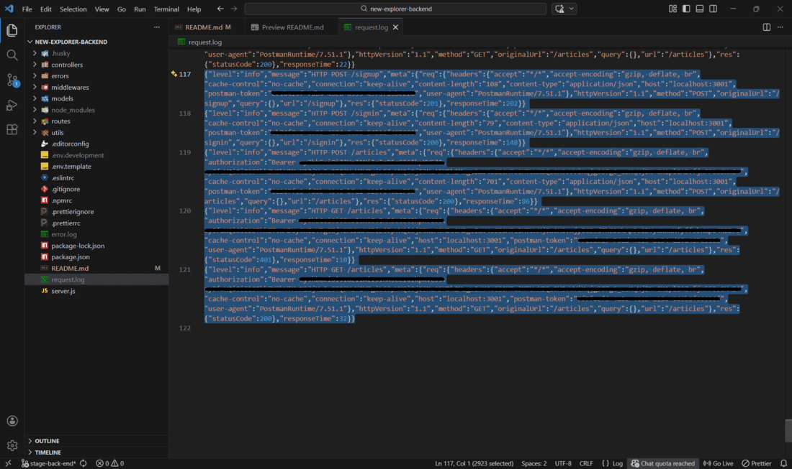
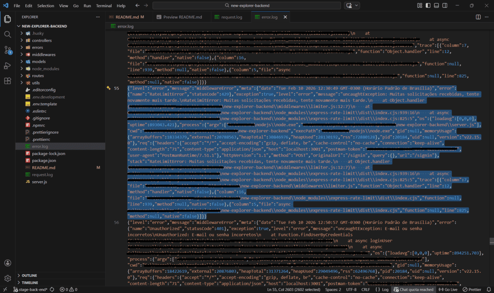
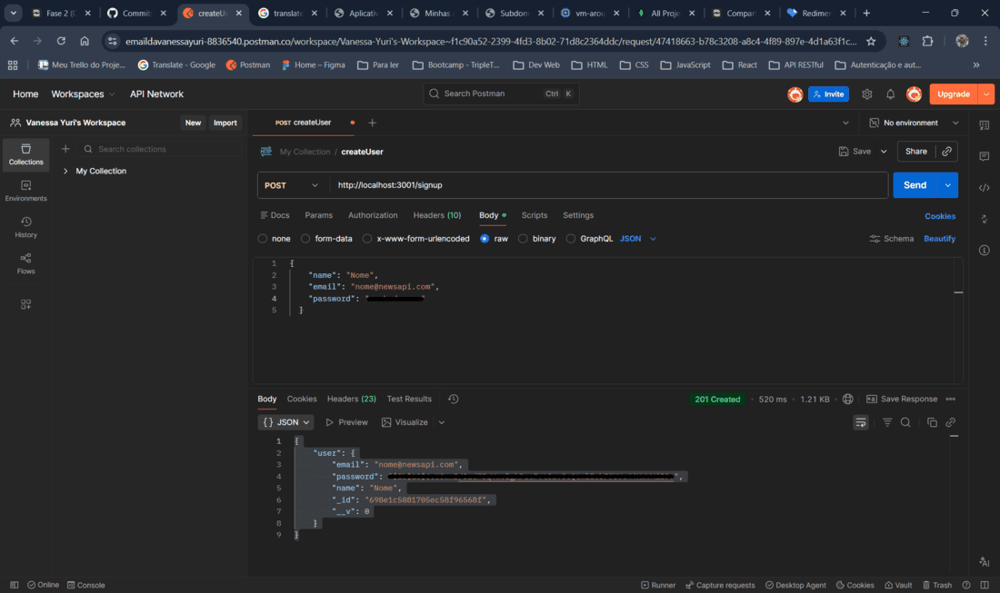
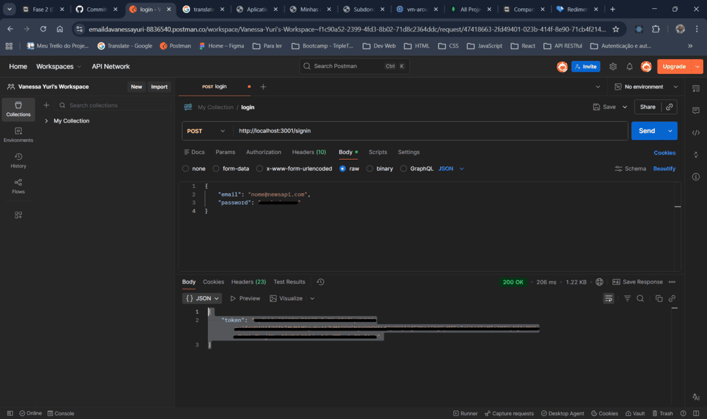
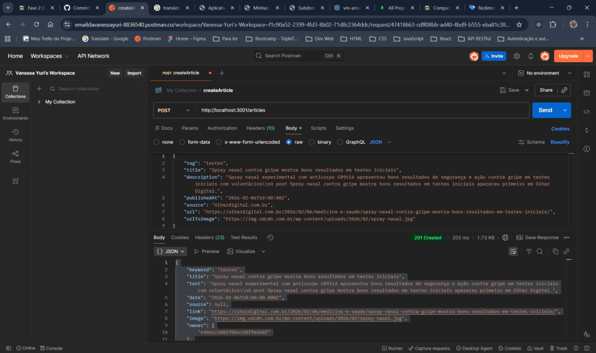
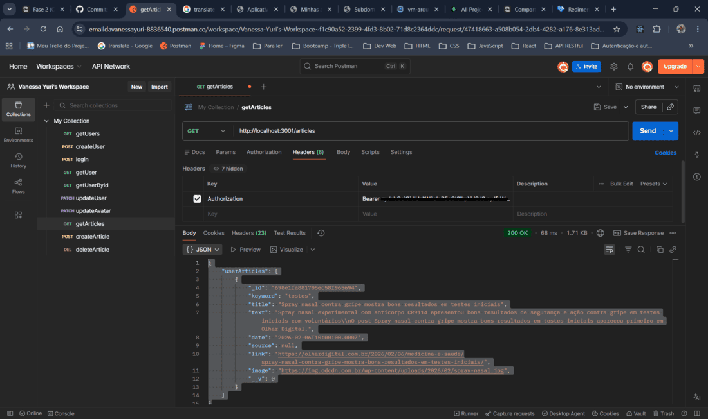

<a id="top"></a>

# 🅽 Projeto Final - News Explorer (Fase 2: Back-end)

<!-- ⚙️ Tecnologias principais -->

[](https://nodejs.org/pt)
[]()
[]()
[]()

<!-- 🧰 Ferramentas e qualidade de código -->

[](https://www.npmjs.com/package/eslint-config-airbnb)
[](https://prettier.io/)
[](https://editorconfig.org/)
[](https://typicode.github.io/husky/)
[](https://github.com/okonet/lint-staged)

<!-- 💾 Infraestrutura e controle de versão -->

[](https://www.npmjs.com/package/winston)
[](https://www.npmjs.com/package/dotenv)
[](https://git-scm.com/)
[](https://github.com/VanessaYuriAB/web_project_api_full)

---

## 📑 Índice

1. [Descrição 📚](#-1-descrição)
2. [Funcionalidades 🚀](#-2-funcionalidades)
3. [Estrutura do Projeto 🗃️](#️-3-estrutura-do-projeto)
4. [Tecnologias Principais 🛠️](#️-4-tecnologias-principais)
5. [Rotas da API 🌐](#-5-rotas-da-api)
6. [Screenshots 📸](#-6-screenshots)
7. [Instalação e Execução 📦](#-7-instalação-e-execução)
8. [Implantação 🔐](#-8-implantação)
9. [Checklist Atendido 📋](#-9-checklist-atendido)
10. [Status do Projeto 🚧](#-10-status-do-projeto)
11. [Melhorias 📈](#-11-melhorias)
12. [Autora 👩‍💻](#-12-autora)

---

<a id="-1-descrição"></a>

## 📚 1. Descrição

Esta é a **Fase 2 - Back‑end do projeto final News Explorer** do bootcamp TripleTen.

Aqui foi desenvolvida a **API RESTful** responsável por:

- Registrar usuários e autenticar via `JWT`
- Permitir que usuários salvem e removam artigos
- Retornar artigos vinculados ao usuário autenticado
- Proteger rotas com middleware de autorização
- Registrar logs de requisições e erros
- Validar corpo, cabeçalho e parâmetro com `celebrate/Joi`
- Rodar em modo de produção via servidor configurado com `HTTPS`

Este back‑end permite o uso completo do front‑end construído na Fase 1.

[Voltar ao topo 🔝](#top)

---

<a id="-2-funcionalidades"></a>

## 🚀 2. Funcionalidades

### Autenticação & Autorização 🔐

- Registro de usuários (`POST /signup`)
- Login e geração de `JWT` (`POST /signin`)
- Hash seguro de senha com `bcrypt`
- Proteção de rotas com middleware de autenticação

### Artigos Salvos 📰

- Criar artigo (`POST /articles`)
- Buscar artigos do usuário (`GET /articles`)
- Excluir artigo por ID (`DELETE /articles/:articleId`)
- Garantia de que usuários não podem excluir artigos de outros perfis

### Infraestrutura ⚙️

- Conexão com `MongoDB` via `Mongoose`
- Arquitetura modular (controllers, routes, middlewares)
- Logs estruturados (`request.log` e `error.log`)
- Centralização de erros
- Validações com `celebrate/Joi`
- Ambiente de produção com variáveis via `.env`

[Voltar ao topo 🔝](#top)

---

<a id="-3-estrutura-do-projeto"></a>

## 🗃️ 3. Estrutura do Projeto

```
backend/
├─ controllers/
│ ├─ articles.js
│ └─ users.js
├─ errors/
│ ├─ ConfigError.js
│ ├─ ConflictError.js
│ ├─ ForbiddenError.js
│ ├─ NotFoundError.js
│ ├─ RateLimitError.js
│ └─ UnauthorizedError.js
├─ middlewares/
│ ├─ celebrates/
│ │ ├─ articles/
│ │ │ ├─ celebrateForDelete.js
│ │ │ └─ celebrateForPost.js
│ │ ├─ celebrateForAuth.js
│ │ ├─ celebrateForSignin.js
│ │ └─ celebrateForSignup.js
│ ├─ authHandler.js
│ ├─ errorHandler.js
│ ├─ limiter.js
│ ├─ logger.js
│ └─ notFoundPage.js
├─ models/
│ ├─ article.js
│ └─ user.js
├─ routes/
│ ├─ articles.js
│ └─ index.js
├─ utils/
│ ├─ asyncHandlerControllers.js
│ ├─ configEnv.js
│ └─ errorsMsgs.js
├─ error.log
├─ package.json
├─ request.log
└─ server.js
```

[Voltar ao topo 🔝](#top)

---

<a id="-4-tecnologias-principais"></a>

## 🛠️ 4. Tecnologias Principais

- `Node.js`
- `Express`
- `MongoDB` + `Mongoose`
- `JWT`
- `bcryptjs`
- `celebrate` / `Joi`
- `Winston` & `express-winston`
- `dotenv`
- `Helmet`
- `Rate‑Limiter`

[Voltar ao topo 🔝](#top)

---

<a id="-5-rotas-da-api"></a>

## 🌐 5. Rotas da API

### Rotas Públicas 🔓

- `POST /signup`
- `POST /signin`

### Rotas Protegidas (JWT obrigatório) 🔐

- `GET /users/me`
- `GET /articles`
- `POST /articles`
- `DELETE /articles/:articleId`

[Voltar ao topo 🔝](#top)

---

<a id="-6-screenshots"></a>

## 📸 6. Screenshots

Os prints a seguir demonstram o funcionamento real dos middlewares, rotas e logs da API em ambiente local.

### Exemplo de logs (Winston) 📄

#### ➡️ `request.log`, ilustrando o fluxo de autenticação e manipulação de artigos na API:



- _`POST /signup` → usuário criado com sucesso (`201`)_
- _`POST /signin` → usuário autenticado (`200`)_
- _`POST /articles` → artigo salvo utilizando `JWT` válido_
- _`GET /articles` → requisição com token inválido/expirado gerando `401`_
- _`GET /articles` → requisição com token válido retornando `200` com os artigos salvos pelo usuário_

Snippet modelo para cada log:

```json
{
  "level": "info",
  "message": "HTTP POST /signin",
  "meta": {
    "req": {
      "method": "POST",
      "url": "/signin",
      "headers": {
        "authorization": "Bearer <token>"
      }
    },
    "res": { "statusCode": 200 }
  }
}
```

#### ➡️ `error.log`, registro de quando o middleware de `rate limit` é acionado:



Snippet higienizado:

```json
{
  "level": "error",
  "message": "middlewareError",
  "meta": {
    "date": "Tue Feb 10 2026 12:30:49 GMT-0300",
    "error": {
      "name": "RateLimitError",
      "statusCode": 429
    },
    "message": "uncaughtException: Muitas solicitações recebidas, tente novamente mais tarde.",
    "stack": "RateLimitError: Muitas solicitações recebidas, tente novamente mais tarde.\n    at Object.handler (.../middlewares/limiter.js:12:7)\n    at .../node_modules/express-rate-limit/dist/index.cjs:939:16",
    "req": {
      "method": "POST",
      "url": "/signin"
    }
  }
}
```

📌 Tokens, caminhos internos e informações sensíveis foram ocultados por segurança.

### Fluxo de autenticação 🔐

Requisições no `Postman` mostrando:

- `/signup`



Snippet:

```json
{
  "user": {
    "email": "nome@newsapi.com",
    "password": "<hash-da-senha>",
    "name": "Nome",
    "_id": "698e1c5081705ec58f96568f"
  }
}
```

- `/signin`



Snippet:

```json
{
  "token": "<jwt-token>"
}
```

📌 Token e informações sensíveis ocultados por segurança.

### CRUD de artigos funcionando ⚙️

- Operação `POST /articles`



- Operação `GET /articles`



📌 Token ocultado por segurança.

---

<a id="-7-instalação-e-execução"></a>

## 📦 7. Instalação e Execução

1️⃣ Clone o repositório

```shell
git clone git@github.com:VanessaYuriAB/new-explorer-backend.git
```

2️⃣ Instale as dependências

```shell
npm install
```

3️⃣ Execute em modo desenvolvimento

```shell
npm run dev
```

📌 O projeto possui fallbacks para as variáveis de ambiente, portanto roda normalmente sem a configuração de um arquivo `.env`. Entretanto, há um `.env.template` como modelo.

[Voltar ao topo 🔝](#top)

---

<a id="-8-implantação"></a>

## 🔐 8. Implantação

- Servidor configurado na nuvem (`Google Cloud` recomendado)
- Domínio configurado e apontando para o servidor
- Certificados `HTTPS` instalados
- Variáveis de ambiente definidas no servidor
- API acessível via domínio: `https://api.newsexplorer.sevencomets.com`

[Voltar ao topo 🔝](#top)

---

<a id="-9-checklist-atendido"></a>

## 📋 9. Checklist Atendido

✔ Estrutura de pastas seguindo boas práticas

✔ Hash seguro de senha

✔ `JWT` armazenado somente no servidor (chave em `.env`)

✔ Middlewares separados e organizados

✔ Logs de requisições e erros gerados

✔ Validações no corpo, parâmetros e headers

✔ Tratamento centralizado de erros

✔ API rodando via `HTTPS` em produção

✔ Usuários não podem deletar artigos de outros usuários

✔ Scripts `start` e `dev` funcionando

✔ `ESLint` com `Airbnb Base` configurado corretamente

[Voltar ao topo 🔝](#top)

---

<a id="-10-status-do-projeto"></a>

## 🚧 10. Status do Projeto

- Fase 2 concluída (Back‑end)
- Próxima etapa: Fase 3 - Autorização com React

[Voltar ao topo 🔝](#top)

---

<a id="-11-melhorias"></a>

## 📈 11. Melhorias

- Adicionar conteúdo sobre o `.nvmrc` aqui no `README` do projeto
- Adicionar testes automatizados (`Jest` e `SuperTest`)

[Voltar ao topo 🔝](#top)

---

<a id="-12-autora"></a>

## 👩‍💻 12. Autora

Desenvolvido por Vanessa Yuri A. Brito, unindo back‑end e front‑end para criar uma aplicação completa e escalável.

[Voltar ao topo 🔝](#top)
